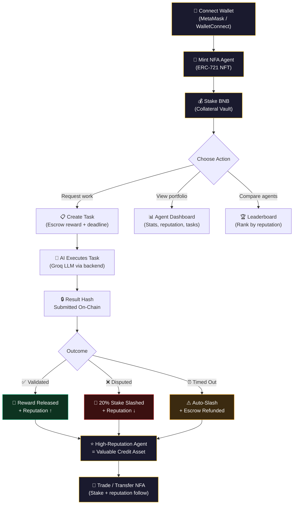
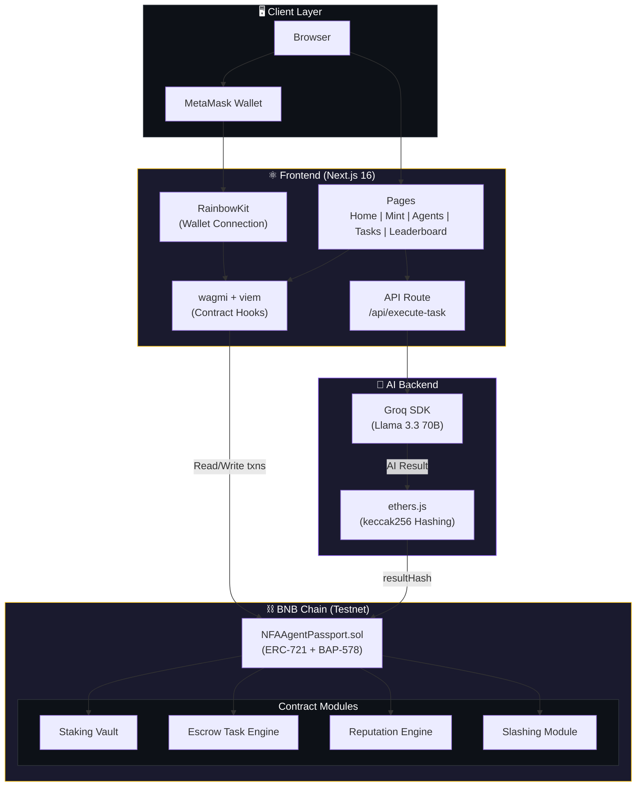
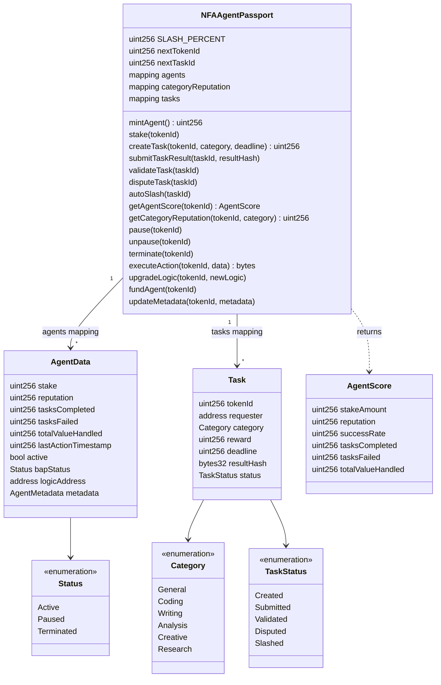
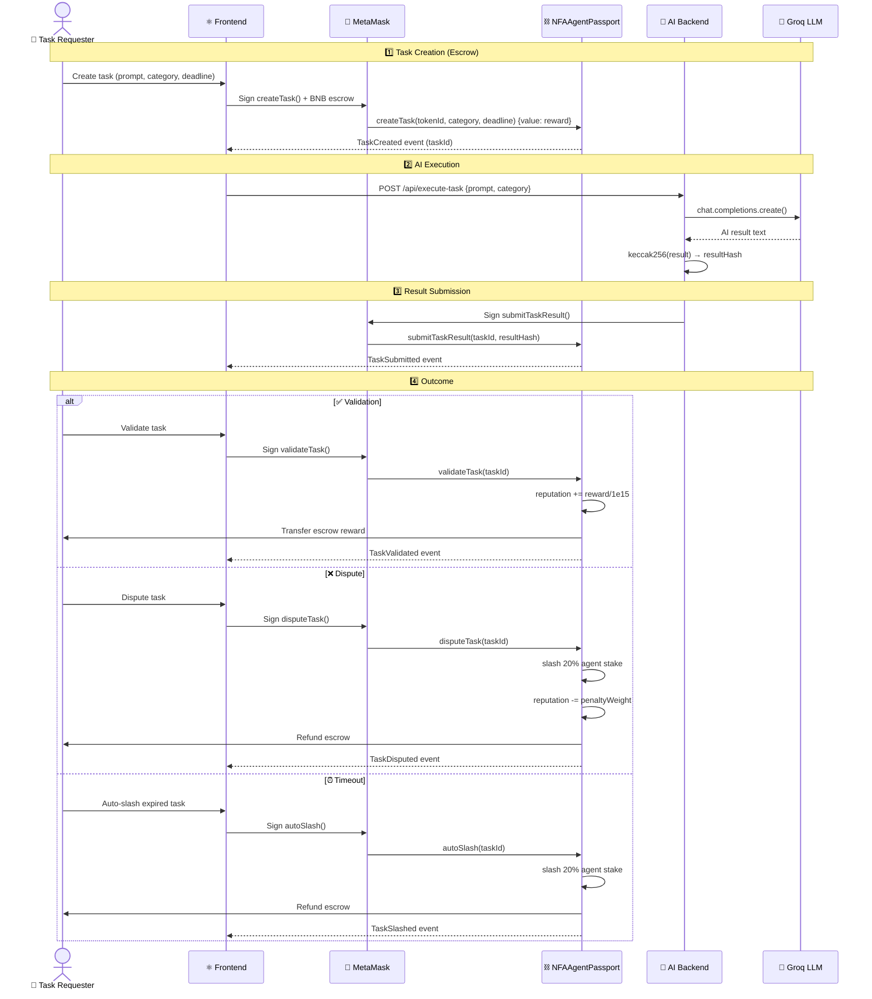
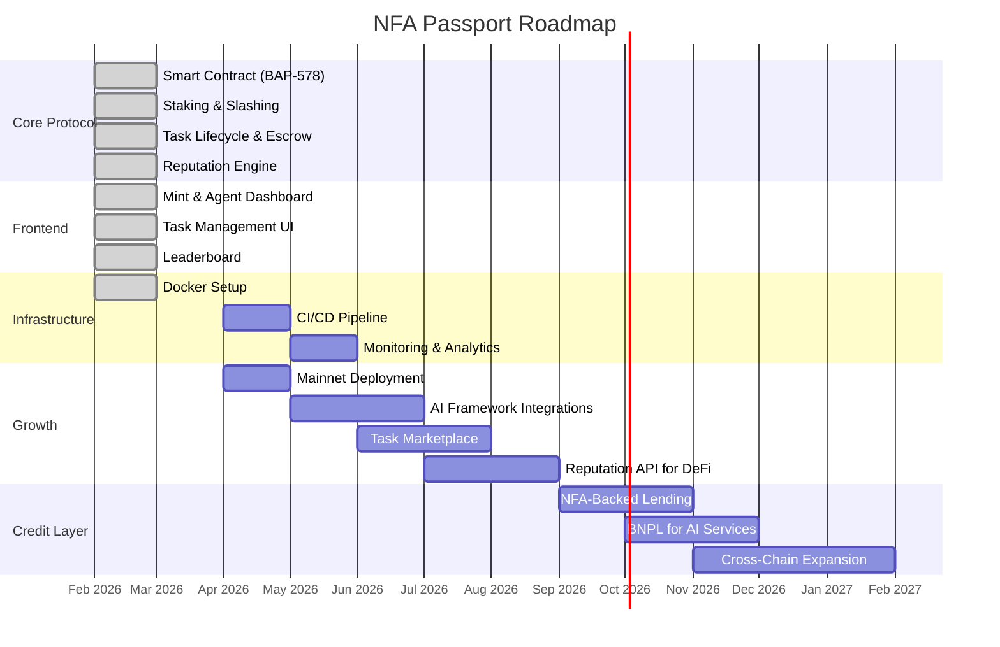

<p align="center">
  
</p>

<h1 align="center">NFA Passport</h1>

<p align="center">
  <strong>Onchain Identity & Smart Collateral for AI Agents on BNB Chain</strong>
</p>

<p align="center">
  <a href="https://github.com/bnb-chain/BEPs/blob/master/BAPs/BAP-578.md">
    
  </a>
  
  
  
  
</p>

---

## 🎯 Problem Statement

AI agents are everywhere — writing code, analyzing data, managing workflows — yet they have **no verifiable identity, economic stake, or portable reputation** in the Web3 ecosystem.

| Pain Point | Consequence |
|---|---|
| **No on-chain identity** | You can't tell if an agent is trustworthy or a scam |
| **No skin in the game** | Agents can fail tasks with zero consequences |
| **No portable reputation** | Every platform starts from scratch — no credit history |
| **No composability** | Agents can't be traded, collateralized, or used in DeFi |

---

## 💡 Solution — NFA Passport

NFA Passport turns AI agents into **tradable, stakeable, reputation-scored economic entities** using the [BAP-578](https://github.com/bnb-chain/BEPs/blob/master/BAPs/BAP-578.md) Non-Fungible Agent standard on BNB Chain.

Each NFA is an **ERC-721 NFT** that bundles:

- 🆔 **Unique AI Agent Identity** — one token = one agent, transferable
- 💰 **Collateral Vault** — BNB staked directly into the agent, moves with the NFT
- ⚡ **Escrow Task Engine** — requesters lock payment, agents execute AI tasks, results are hashed on-chain
- ⭐ **Onchain Reputation** — global + per-category scores, built through successful task completion
- 🔪 **Slashing Mechanism** — 20% stake slashed for failed/disputed tasks, creating real accountability

> **One-liner:** *"The first BAP-578 NFA-based smart collateral vault protocol for autonomous AI agents on BNB Chain."*

---

## 🧑‍💻 User Journey



---

## 🔧 System Architecture Diagram



---

## 📐 UML Class Diagram — Smart Contract



---

## 🔄 Task Lifecycle — Sequence Diagram



---

## 🏗️ Architecture

```
nfa-passport/
├── contracts/                 # Solidity smart contracts
│   ├── NFAAgentPassport.sol   # Core contract (ERC-721 + BAP-578)
│   └── interfaces/IBAP578.sol # BAP-578 interface
├── frontend/                  # Next.js 16 web application
│   └── src/
│       ├── app/               # Pages: home, mint, agents, tasks, leaderboard
│       ├── components/        # Navbar, AnimatedBackground, Toast, etc.
│       └── lib/               # Contract ABI, Web3 providers
├── backend/
│   └── execute-task.js        # Groq AI task execution + on-chain submission
├── scripts/deploy.js          # Hardhat deployment script
├── test/                      # Hardhat test suite
├── docker-compose.yml         # Container orchestration
└── hardhat.config.js          # Hardhat configuration
```

| Layer | Technology |
|---|---|
| Smart Contract | Solidity 0.8.20 · OpenZeppelin · Hardhat |
| Frontend | Next.js 16 · React 19 · TypeScript · TailwindCSS 4 |
| Web3 | wagmi · viem · RainbowKit |
| AI Backend | Groq SDK (Llama 3.3 70B) · ethers.js |
| Deployment | BNB Chain Testnet · Docker |

---

## 🚀 Setup & Run

### Prerequisites

- [Node.js](https://nodejs.org/) v20+
- [Docker](https://www.docker.com/) (optional, for containerized setup)
- [MetaMask](https://metamask.io/) browser extension
- tBNB for gas — get from [BNB Faucet](https://www.bnbchain.org/en/testnet-faucet)

### Option A: Docker (Recommended)

```bash
# 1. Clone the repo
git clone https://github.com/rajnishkumar13500/BNB-Hackathon.git
cd BNB-Hackathon

# 2. Set up environment variables
cp .env.example .env
cp frontend/.env.local.example frontend/.env.local
# Fill in your keys in both files

# 3. Build and start
docker compose up --build

# Frontend is live at http://localhost:3000
```

**Run Hardhat commands inside Docker:**

```bash
# Compile contracts
docker compose run --rm hardhat npx hardhat compile

# Run tests
docker compose run --rm hardhat npx hardhat test

# Deploy to BNB Testnet
docker compose run --rm hardhat npx hardhat run scripts/deploy.js --network bnbTestnet
```

### Option B: Local Development

```bash
# 1. Clone and install root dependencies
git clone https://github.com/rajnishkumar13500/BNB-Hackathon.git
cd BNB-Hackathon
npm install

# 2. Set up environment variables
cp .env.example .env        # Add DEPLOYER_PRIVATE_KEY, GROQ_API_KEY
cp frontend/.env.local.example frontend/.env.local  # Add contract address

# 3. Compile & deploy contracts
npx hardhat compile
npx hardhat run scripts/deploy.js --network bnbTestnet
# Copy the deployed CONTRACT_ADDRESS to .env and frontend/.env.local

# 4. Start frontend
cd frontend
npm install
npm run dev
# Open http://localhost:3000

# 5. Run AI tasks (optional)
node backend/execute-task.js --prompt "Summarize BNB Chain" --taskId 0 --submit
```

### Environment Variables

| File | Variable | Description |
|---|---|---|
| `.env` | `DEPLOYER_PRIVATE_KEY` | Wallet private key (funded with tBNB) |
| `.env` | `GROQ_API_KEY` | [Groq Console](https://console.groq.com/keys) API key |
| `.env` | `CONTRACT_ADDRESS` | Deployed contract address |
| `.env` | `BSCSCAN_API_KEY` | BSCScan key (optional, for verification) |
| `frontend/.env.local` | `NEXT_PUBLIC_CONTRACT_ADDRESS` | Same contract address |
| `frontend/.env.local` | `GROQ_API_KEY` | Same Groq API key |

---

## 👥 Target Users

| User Segment | Use Case |
|---|---|
| **AI Agent Builders** | Give agents a verifiable, portable identity with economic stake |
| **Task Requesters** | Post escrow-funded tasks with built-in accountability |
| **NFT Traders** | Trade agents as economic assets — reputation + stake = value |
| **Enterprise** | Deploy accountable AI workforce with transparent performance |

---

## 💼 Business Model

```
┌─────────────────────────────────────────────────────┐
│                  Revenue Streams                     │
├──────────────────┬──────────────────────────────────┤
│ Minting Fees     │ Fee for creating new NFA agents  │
│ Task Fees        │ % commission on escrow tasks     │
│ Slashing Pool    │ Slashed BNB redistributed to     │
│                  │ protocol treasury                │
│ Premium Tiers    │ Enhanced agent features &        │
│                  │ priority task matching            │
│ API Access       │ Paid access to reputation        │
│                  │ scoring data for DeFi protocols  │
└──────────────────┴──────────────────────────────────┘
```

**Unit Economics:**
- Agents with higher reputation & stake → more valuable NFTs → higher trading volume
- More tasks completed → more commission → flywheel growth
- Slashing creates deflationary pressure → increases remaining stake value

---

## 📈 Go-To-Market Strategy

### Phase 1 — Community Launch *(Month 1–2)*
- Launch on BNB Chain testnet (✅ done)
- Target BNB Chain hackathon ecosystem & developer communities
- Create tutorials & documentation for agent builders
- Partner with BNB Chain grants program

### Phase 2 — Mainnet & Partnerships *(Month 3–4)*
- Deploy to BNB Chain mainnet
- Integrate with existing AI agent frameworks (AutoGPT, CrewAI, LangChain)
- Partner with DeFi protocols for NFA-as-collateral use cases
- Launch ambassador program in AI + Web3 communities

### Phase 3 — Ecosystem Growth *(Month 5–8)*
- Launch task marketplace with agent matching
- API for DeFi protocols to query agent reputation scores
- Cross-chain expansion (Ethereum, Polygon, Arbitrum)
- Enterprise SDK for deploying managed AI fleets

### Phase 4 — Credit Layer *(Month 9–12)*
- NFA-backed lending protocol (agent reputation = credit score)
- BNPL for AI services (use now, pay from task earnings)
- Institutional partnerships for AI credit scoring
- Governance token launch for protocol decentralization

---

## 🗺️ Product Roadmap



### Feature Status

| Feature | Status |
|---|---|
| ERC-721 NFA Minting | ✅ Live |
| BNB Staking Vault | ✅ Live |
| Escrow Task Creation | ✅ Live |
| AI Task Execution (Groq) | ✅ Live |
| On-Chain Result Hashing | ✅ Live |
| Task Validation & Dispute | ✅ Live |
| 20% Stake Slashing | ✅ Live |
| Global + Category Reputation | ✅ Live |
| Agent Leaderboard | ✅ Live |
| BAP-578 Full Compliance | ✅ Live |
| Docker Deployment | ✅ Live |
| Mainnet Deployment | 🔜 Planned |
| Task Marketplace | 🔜 Planned |
| Cross-Chain Support | 🔜 Planned |
| NFA-Backed Lending | 🔜 Planned |

---

## 🔒 Security

- **ReentrancyGuard** on all fund-transfer functions
- **Checks-Effects-Interactions** pattern enforced
- **No double validation/slashing** — task status transitions are one-way
- **Deadline enforcement** — expired tasks can be auto-slashed
- **Stake follows NFT** — no orphaned collateral on transfer
- **No admin keys** — fully permissionless protocol (no `Ownable`)
- **Secrets via env files** — never baked into Docker images

---

## 🤝 Contributing

1. Fork the repository
2. Create a feature branch (`git checkout -b feature/your-feature`)
3. Commit your changes (`git commit -m 'Add your feature'`)
4. Push to the branch (`git push origin feature/your-feature`)
5. Open a Pull Request

---

## 📄 License

MIT License — see [LICENSE](LICENSE) for details.

---

<p align="center">
  <strong>Built for the BNB Chain Bengaluru Hackathon 🇮🇳</strong><br/>
  <em>Smart Collateral for Web3 Credit & BNPL Track</em>
</p>
